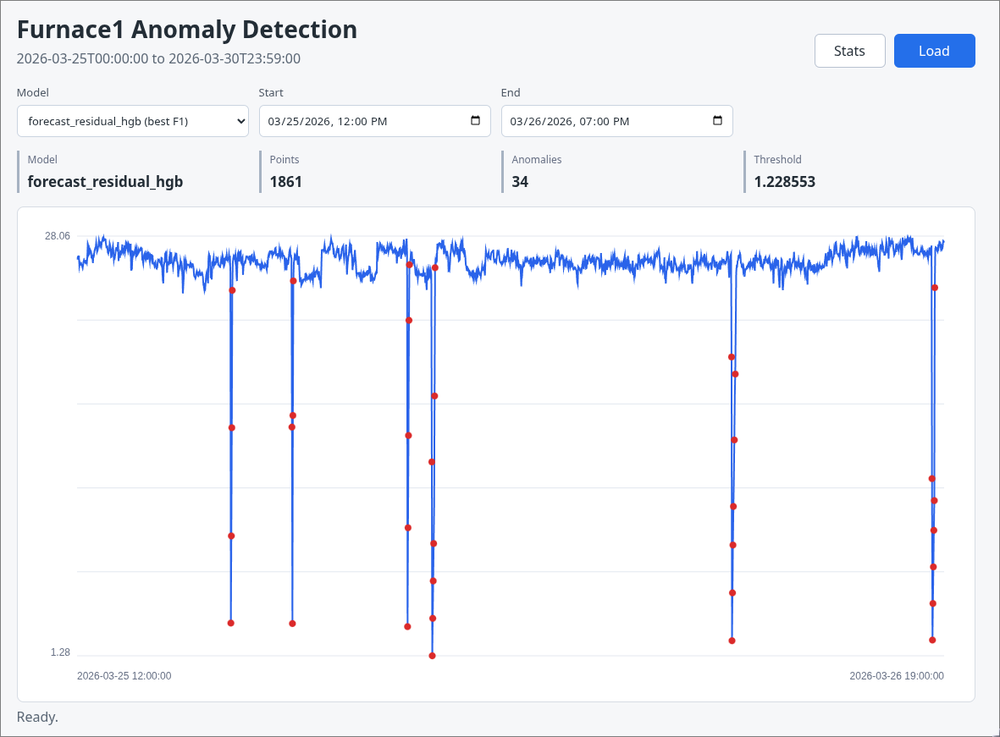
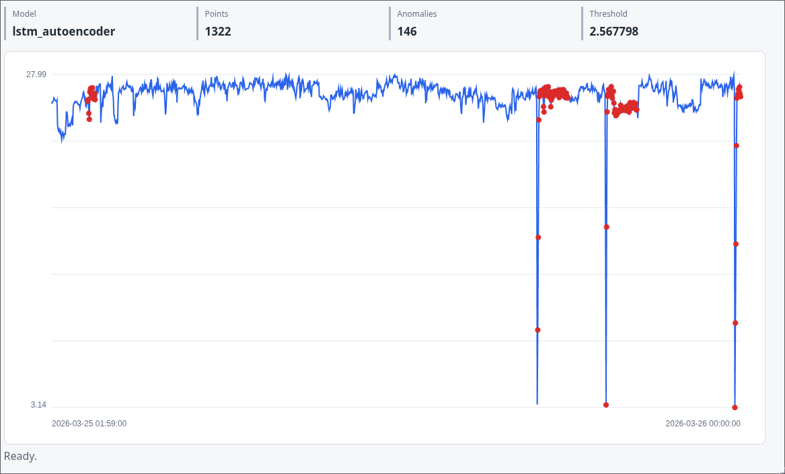

# Furnace1 Anomaly Detection Report

## Overview

This project trains anomaly detection models for `dataset/Furnace1.csv` and exposes the exported models through a FastAPI web application. The application serves historical furnace data from the CSV, applies a selected model over a requested date range, and visualizes `active_power` with detected anomaly markers.

The Furnace1 dataset contains 8,150 one-minute samples from `2026-03-25 00:00:00` to `2026-03-30 23:59:00`. The dataset analysis showed that almost every numeric feature is constant; `active_power` is the only signal with meaningful variance. Because of that, the final implementation treats Furnace1 anomaly detection as a univariate time-series problem centered on `active_power`.

## Dataset and Labels

The original CSV does not include verified anomaly labels. To support Precision, Recall, and F1 evaluation, the implementation uses documented proxy labels:

- `active_power < 10.0`
- absolute one-minute `active_power` change greater than `5.0`

After lag and rolling feature generation, 8,090 rows remain for model training and evaluation.

| Split | Rows | Proxy anomalies |
|---|---:|---:|
| Train | 4,854 | 94 |
| Validation | 1,618 | 3 |
| Test | 1,618 | 72 |

## Model Training

Five models were trained and exported:

| Model | Type | Exported artifact |
|---|---|---|
| `forecast_residual_hgb` | HistGradientBoostingRegressor residual detector | `models/forecast_residual_hgb.joblib` |
| `one_class_svm` | One-Class SVM | `models/one_class_svm.joblib` |
| `isolation_forest` | Isolation Forest | `models/isolation_forest.joblib` |
| `lstm_autoencoder` | PyTorch LSTM autoencoder | `models/lstm_autoencoder.joblib`, `models/lstm_autoencoder.pt` |
| `local_outlier_factor` | Local Outlier Factor with novelty detection | `models/local_outlier_factor.joblib` |

The tabular detectors use lagged, rolling, difference, and time-of-day features. The LSTM autoencoder uses normalized 60-minute sliding windows of `active_power` and scores each window by reconstruction error.

## Evaluation Results

All thresholds were tuned on the validation split and final metrics were computed on the held-out test split.

| Rank | Model | Precision | Recall | F1 | Threshold |
|---:|---|---:|---:|---:|---:|
| 1 | `forecast_residual_hgb` | 0.7889 | 0.9861 | 0.8765 | 1.228553 |
| 2 | `one_class_svm` | 0.6667 | 1.0000 | 0.8000 | 2.524655 |
| 3 | `isolation_forest` | 0.6600 | 0.9167 | 0.7674 | 0.148708 |
| 4 | `lstm_autoencoder` | 0.2136 | 0.8750 | 0.3433 | 2.567798 |
| 5 | `local_outlier_factor` | 1.0000 | 0.0556 | 0.1053 | 16.834864 |

`forecast_residual_hgb` performed best overall with the highest F1 score. It detected 71 of 72 proxy anomalies on the test split while producing 19 false positives. `one_class_svm` had perfect recall but more false positives. `local_outlier_factor` was very conservative: it had perfect precision but missed most proxy anomalies.

## Web Application

The FastAPI application serves both JSON endpoints and static HTML/CSS/JS pages.

Main endpoints:

- `GET /` serves the anomaly chart page.
- `GET /stats` serves the model evaluation stats page.
- `GET /health` reports dataset/model readiness.
- `GET /api/models` returns exported model metadata and metrics.
- `GET /api/predictions?startDate=...&endDate=...&modelName=...` returns scored time-series points.

Run the app from `packages/final`:

```bash
uv run uvicorn final_anomaly.api:app --reload
```

Then open:

- Chart page: `http://127.0.0.1:8000/`
- Stats page: `http://127.0.0.1:8000/stats`

## Screenshots

### Forecast Residual HGB

The residual model is the default model because it has the best held-out F1 score. The chart shows low-power regions flagged as anomalies.



### LSTM Autoencoder

The LSTM autoencoder is available as a sequence model over 60-minute windows. It is more sensitive and produces more false positives on the current proxy-label benchmark.



## Conclusion

The project exports five usable anomaly detection models and provides a FastAPI interface for comparing their predictions over real Furnace1 CSV data. Based on the current proxy-label evaluation, `forecast_residual_hgb` is the strongest default model. The main limitation is label quality: Precision, Recall, and F1 are measured against proxy rules, not manually verified furnace fault annotations.

## Links

GitHub: [abzy128/aitu-ai-n-nn](https://github.com/abzy128/aitu-ai-n-nn/tree/dev/packages/final)
