# Artificial Intelligence Technology and Application: Midterm Report

**Student:** Abzal Orazbek
**Group:** AAI-2501M

---

## Course Review

The course covers a broad range of AI topics, from high-level overviews down to hands-on lab work. Here are my thoughts on each part:

**Chapters 1–2: AI Overview & Python Basics.** The introductory chapter on AI gave a decent bird's-eye view of the field. The Python section (2.1–2.2) was mostly review for me since I already had programming experience, but it was a solid refresher on the basics and a good on-ramp for those coming from other languages.

**Chapter 3: Machine Learning.** This was one of the more valuable theory sections. The breakdown of the ML process (3.2) — from data preparation to model evaluation — was well structured. The common algorithms chapters (3.3.1–3.3.4) covered a good spread: regression, trees, SVMs, and clustering. I appreciated the breadth, though some sections felt surface-level.

**Chapter 4: Deep Learning Overview.** I found chapter 4 genuinely interesting. The treatment of training rules, activation functions, normalization, and optimizers (4.2–4.5) provided useful intuition for understanding why networks train the way they do. The neural network types overview (4.6) was a nice survey before diving into labs.

**Chapters 5–6: MindSpore & Huawei Platforms.** MindSpore seems like an interesting framework with some unique design choices (graph mode, auto-differentiation API), but I personally prefer PyTorch for its flexibility and ecosystem. The Huawei platform chapters (Ascend, Cloud EI, HiAI) were informative from an industry perspective, though not directly applicable to my day-to-day work.

**Chapters 7–8: Cutting-edge AI & Quantum Computing.** These were brief but thought-provoking. The quantum computing chapter in particular felt like a teaser — would have appreciated more depth there.

**Chapter 9: Lab Work.** This was the highlight of the course for me. The hands-on labs made the theory concrete — especially the progression from Python basics (9.2) through classical ML (9.3) to deep learning (9.4). Implementing gradient descent from scratch and training CNNs on real datasets was far more instructive than any lecture slide. The lab guides were generally clear, though some required dataset files that were not always easy to obtain.

**Final Exam.** I passed the final exam with a grade of **80/100**.

---

## Section 9.2: Python Programming Fundamentals

### 1. Introduction

This section establishes the core Python programming foundation required for machine learning and deep learning work. The labs cover data types, control flow, functions, object-oriented programming, and standard library usage.

### 2. Lab 9.2.1–9.2.2: Data Types and String Operations

We explored Python's fundamental data types: numbers, booleans, strings, lists, tuples, dictionaries, and sets.

```python
# Numeric operations
x, y = 15, 4
print(f"{x} + {y} = {x + y}")   # 19
print(f"{x} / {y} = {x / y}")   # 3.75
print(f"{x} // {y} = {x // y}") # 3

# String immutability and methods
text = " Machine Learning Fundamentals "
print("Stripped:", text.strip())   # "Machine Learning Fundamentals"
print("Words:", text.split())      # ['Machine', 'Learning', 'Fundamentals']
```

Key takeaway: understanding string immutability and collection types (lists vs tuples vs sets) is essential for data preprocessing pipelines later.

### 3. Lab 9.2.3: Functions and OOP

We implemented parameterized functions and class hierarchies relevant to ML model organization:

```python
class Model:
    def __init__(self, name, params):
        self.name = name
        self.params = params

    def summary(self):
        print(f"{self.name}: {self.params} parameters")

class ConvNet(Model):
    def __init__(self, name, params, num_layers):
        super().__init__(name, params)
        self.num_layers = num_layers
```

Output:
```
ResNet18: 11700000 parameters
  Layers: 18
Training ResNet18...
```

This OOP pattern directly maps to how PyTorch and other frameworks structure neural network definitions.

### 4. Lab 9.2.4: Standard Library

We used `sys`, `os`, and `time` modules for system interaction, path manipulation, and execution timing — all critical for training pipeline management.

---

## Section 9.3: Machine Learning

### 1. Introduction

This section transitions from pure programming to applied machine learning. We implemented regression, classification, clustering, and NLP pipelines using NumPy, Pandas, Scikit-Learn, and Matplotlib.

### 2. Lab 9.3.1: Linear Regression (sklearn)

Using a house price dataset, we fitted a linear regression model:

```python
lr = LinearRegression().fit(area, price)
# Slope (w): 3.07, Intercept (b): 14.09
# Predicted price for 100 m²: 320.7k$
```

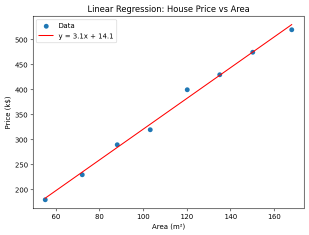

The model captures the linear relationship between area and price with a clear upward trend.

### 3. Lab 9.3.2: Gradient Descent from Scratch

We implemented linear regression manually using gradient descent to understand the optimization process:

```python
def gradient_step(w, b, x, y, lr):
    n = len(x)
    pred = model(w, b, x)
    dw = (2 / n) * np.sum((pred - y) * x)
    db = (2 / n) * np.sum(pred - y)
    return w - lr * dw, b - lr * db
```

After 10,000 iterations with learning rate 0.0001:
```
Epoch     0 | Loss: 4269.9000 | w=0.0000 b=0.0000
Epoch  2000 | Loss:    4.7936 | w=1.0478 b=0.3259
Epoch 10000 | Loss:    3.5102 | w=1.0334 b=1.3341
```

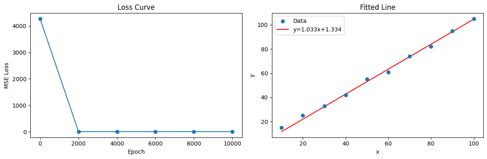

The loss curve shows rapid initial convergence followed by gradual refinement, demonstrating the typical behavior of gradient descent with a fixed learning rate.

### 4. Lab 9.3.3: Feature Engineering

On a synthetic bank credit dataset, we performed missing value imputation, correlation analysis, and feature importance ranking:

```
Feature importances (Random Forest):
 Duration       0.1047
 Age            0.1796
 LoanAmount     0.2322
 CreditScore    0.2330
 Income         0.2505
```

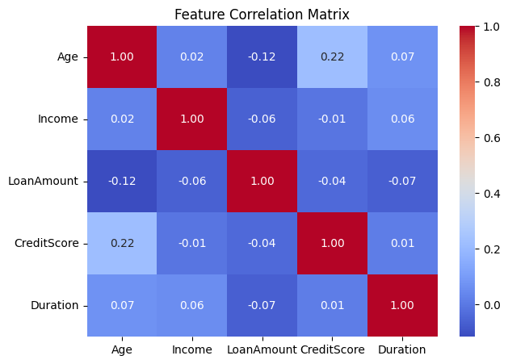

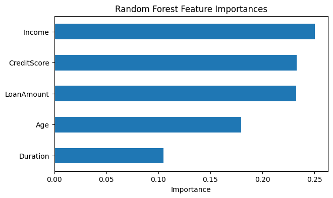

Income and CreditScore emerged as the most predictive features for credit default, which aligns with domain knowledge.

### 5. Lab 9.3.4–9.3.5: Classification (Titanic & Iris)

**Titanic Survival Prediction** — We compared three classifiers:

| Model               | Accuracy |
|---------------------|----------|
| Logistic Regression | 0.7989   |
| Random Forest       | 0.8268   |
| AdaBoost            | 0.7933   |

Random Forest achieved the best accuracy. Survival rates by class: 1st (63%), 2nd (47%), 3rd (24%).

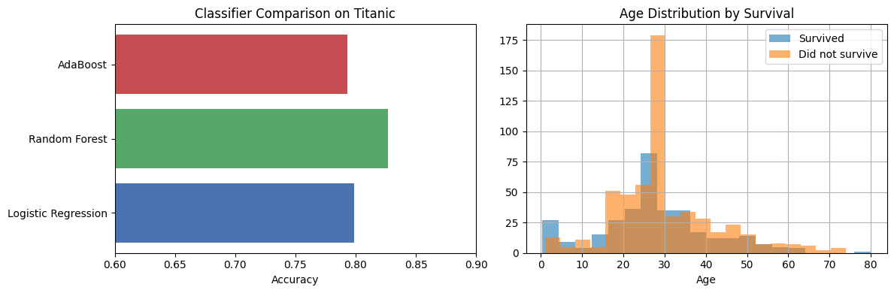

**Iris Classification** — All four classifiers (Logistic Regression, SVM, Decision Tree, KNN) achieved 100% accuracy on this well-separated dataset, particularly after feature scaling.

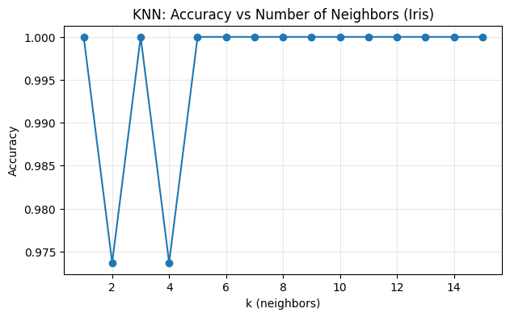

### 6. Lab 9.3.6: K-Means Clustering

We applied K-Means with different cluster counts and used the Elbow Method to find the optimal k:

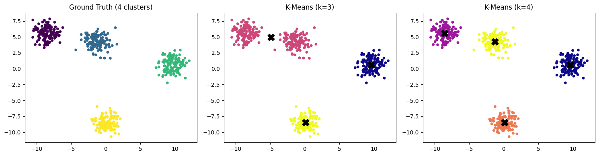

With k=4 (matching the ground truth), the algorithm correctly identifies all cluster boundaries. The Elbow Method plot below confirms k=6 as the optimal value for a separate 6-center dataset:

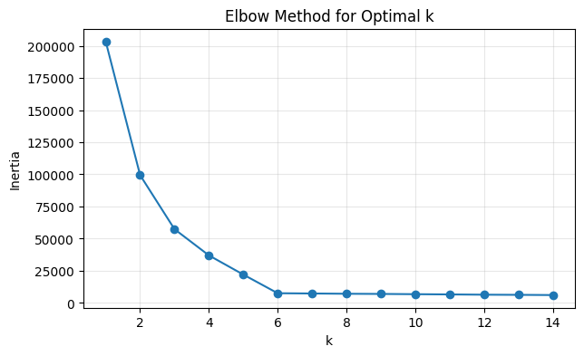

### 7. Lab 9.3.7–9.3.9: Sentiment Analysis

Using TF-IDF features with a Multinomial Naive Bayes classifier:

```python
pipeline = Pipeline([
    ("vect", CountVectorizer()),
    ("tfidf", TfidfTransformer()),
    ("clf", MultinomialNB()),
])
```

The model correctly classified new unseen reviews:
```
'great product really enjoyed it' -> pos
'bad quality never again' -> neg
```

---

## Section 9.4: Deep Learning with PyTorch

### 1. Introduction

This section covers deep neural network fundamentals using PyTorch (as an alternative to Huawei's MindSpore). We progress from tensor basics through fully connected networks to convolutional architectures for both vision and text.

### 2. Lab 9.4.1: Tensor Fundamentals

We explored PyTorch tensor creation, attributes, indexing, arithmetic, and automatic differentiation:

```python
x = torch.tensor([[2.0, 3.0]], requires_grad=True)
w = torch.tensor([[1.0], [2.0]], requires_grad=True)
y = x @ w   # y = 2*1 + 3*2 = 8.0
y.backward()
# dy/dx = [1.0, 2.0]  (the weights)
# dy/dw = [2.0, 3.0]  (the inputs)
```

This autograd mechanism is the foundation of backpropagation in neural network training.

### 3. Lab 9.4.2: MNIST Handwritten Digit Recognition

We built a 3-layer fully connected network: 784 → 256 → 128 → 10.

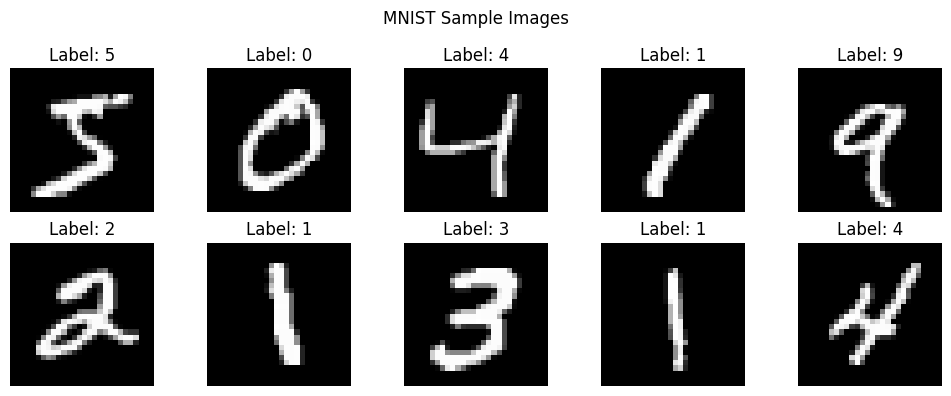

**Training Results:**
```
Epoch 1/5 | Loss: 0.2286
Epoch 2/5 | Loss: 0.0939
Epoch 3/5 | Loss: 0.0661
Epoch 4/5 | Loss: 0.0494
Epoch 5/5 | Loss: 0.0411

Test Accuracy: 0.9761 (9761/10000)
```

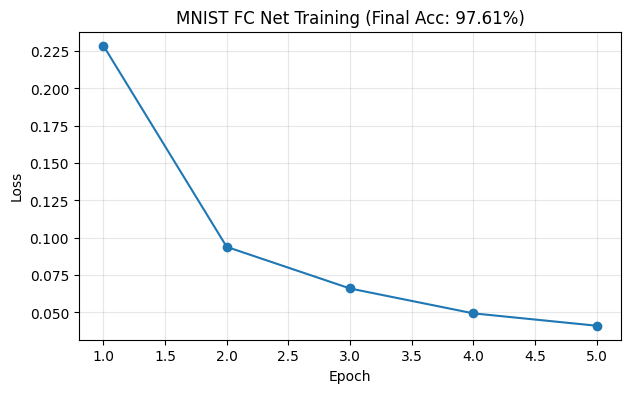

The network achieves 97.6% accuracy in just 5 epochs, demonstrating the effectiveness of even simple architectures on well-structured data.

### 4. Lab 9.4.3–9.4.4: CNN Image Classification (CIFAR-10)

We implemented a 3-layer CNN with Conv2d → ReLU → MaxPool blocks followed by a fully connected classifier:

```python
class SimpleCNN(nn.Module):
    def __init__(self):
        super().__init__()
        self.features = nn.Sequential(
            nn.Conv2d(3, 32, 3, padding=1), nn.ReLU(), nn.MaxPool2d(2),
            nn.Conv2d(32, 64, 3, padding=1), nn.ReLU(), nn.MaxPool2d(2),
            nn.Conv2d(64, 128, 3, padding=1), nn.ReLU(), nn.MaxPool2d(2),
        )
        self.classifier = nn.Sequential(
            nn.Flatten(),
            nn.Linear(128 * 4 * 4, 256), nn.ReLU(), nn.Dropout(0.3),
            nn.Linear(256, 10),
        )
```

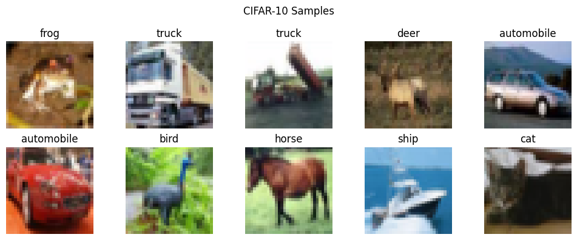

**Training Results:**
```
Epoch 1/5 | Loss: 1.3619
Epoch 2/5 | Loss: 0.9525
Epoch 3/5 | Loss: 0.7829
Epoch 4/5 | Loss: 0.6683
Epoch 5/5 | Loss: 0.5865

CIFAR-10 Test Accuracy: 0.7521
```

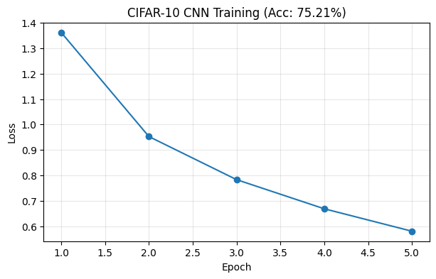

The CNN achieves 75.2% on CIFAR-10 with only 5 epochs of training and 620K parameters. This demonstrates the power of convolutional features over fully connected layers for image data. Further improvements could come from data augmentation, learning rate scheduling, or deeper architectures like ResNet.

### 5. Lab 9.4.5: Text Classification with 1D CNN

We implemented a TextCNN model with multiple kernel sizes (3 and 4) for sentiment classification:

```python
class TextCNN(nn.Module):
    def __init__(self, vocab_size, embed_dim=32, num_filters=16):
        super().__init__()
        self.embedding = nn.Embedding(vocab_size, embed_dim, padding_idx=0)
        self.conv3 = nn.Conv1d(embed_dim, num_filters, kernel_size=3, padding=1)
        self.conv4 = nn.Conv1d(embed_dim, num_filters, kernel_size=4, padding=1)
        self.pool = nn.AdaptiveMaxPool1d(1)
        self.fc = nn.Linear(num_filters * 2, 2)
```

Training converged well (loss dropped from ~0.7 to ~0.001 over 50 epochs), though the tiny test set (4 samples) limits meaningful accuracy evaluation. The architecture demonstrates how 1D convolutions with different kernel sizes capture n-gram patterns in text, analogous to how 2D convolutions capture spatial patterns in images.

---

## Conclusion

Across these three sections, we progressed from Python fundamentals through classical machine learning to deep learning:

1. **Python (9.2):** Established the programming foundation — data structures, OOP, and standard library tools needed for ML/DL pipelines.
2. **Machine Learning (9.3):** Built and evaluated regression, classification, and clustering models. Key insight: proper feature engineering and preprocessing (scaling, imputation) significantly impacts model performance.
3. **Deep Learning (9.4):** Implemented neural networks in PyTorch — FC nets for MNIST (97.6% accuracy), CNNs for CIFAR-10 (75.2%), and TextCNN for sentiment analysis. Demonstrated how architecture choice (FC vs CNN) must match the data modality.

The complete source code is available in the accompanying Jupyter notebooks.
